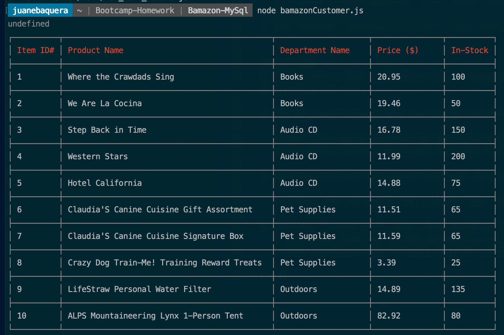
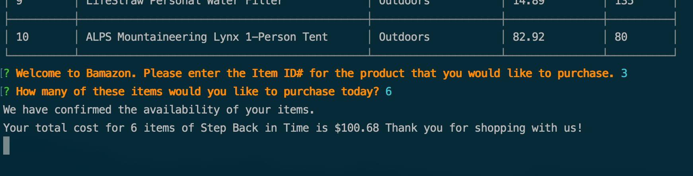
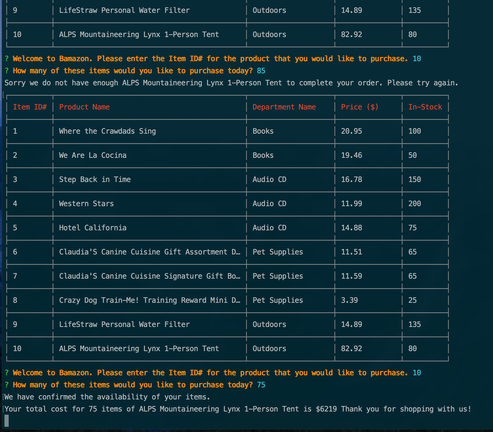

# Node.js & MySQL

## Overview of Bamazon

This activity required the creation of an Amazon-like storefront using a MySQL database to create and track inventory items. The app will take in orders from customers and deplete stock from the store's inventory.

## Package Dependencies
The following npm packages were required for data input, storage, and output display:
   * inquirer v6.4.1
   * dotenv v8.0.0
   * mysql v2.17.1
   * cli-table v0.3.1

## Project Specifications
### Creation of MySQL Database
1. A MySQL Database called `bamazon` was created.

2. The `bamazon` database calls for the creation of a table named `products`. 

3. The `products` table contains product information under each of the following columns:
   * Item ID# (`item_id` -the unique id for each product; used to place orders)
   * Product Name (`product_name` -the name of product as it will appear to the user)
   * Department Name (`department_name` -the department category for the product)
   * Price ($) (`price` -the retail cost of each item to the customer)
   * In-Stock (`stock_quantity` -this number denotes the current in-stock availability for purchase by customers in our store)

4. The `bamazon` database is currently populated with 10 different items from a range of departments.

### Using the CLI App

5. The app works via the creation a Node application called `bamazonCustomer.js`. When you run this application, it will first display all of the items available for sale. These will be displayed in a table format with the following table heads and columns including: Item ID numbers, Product Name, Department Name, retail Price, and finally the current Stock availability of items for sale.

6. Once the table of products is displayed, the app proceeds to prompt users with two messages:  
   * The first will ask the user for the Item ID # of the product they would like to buy. After answering this prompt.  
   * he second message will ask the user to enter a numeric value for how many units of the product they would like to buy. User will hit enter to record the inputs.

7. Once the customer has placed their order, the application will check and confirm that the store has enough of the product in-stock to meet the customer's request.

8. If the store _does_ have enough of the product in-stock, the application will proceed to fulfill the customer's order. A successful purchase will trigger the following events:
   * The SQL database will update to reflect the remaining quantity of items in-stock.
   * The application will show the customer the total cost of their purchase.

8. If not, the app will log the phrase `Sorry we do not have enough (product_name) to complete your order. Please try again.`, and will proceed to prevent the order from being processed. The table will display allowing the user to proceed.

